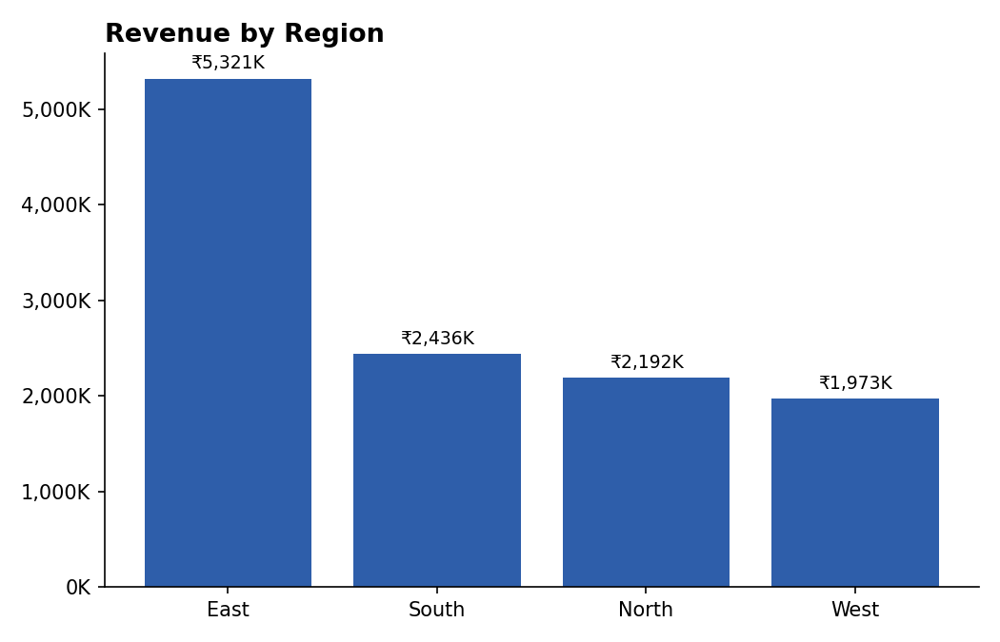
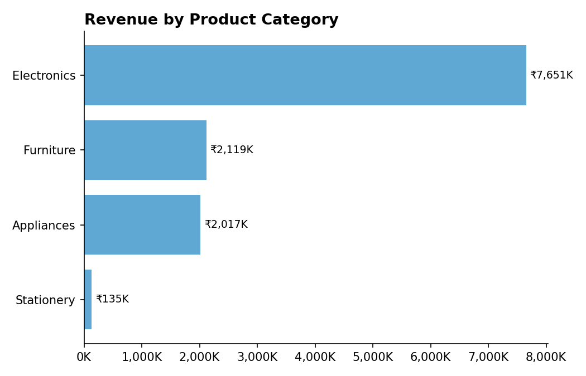
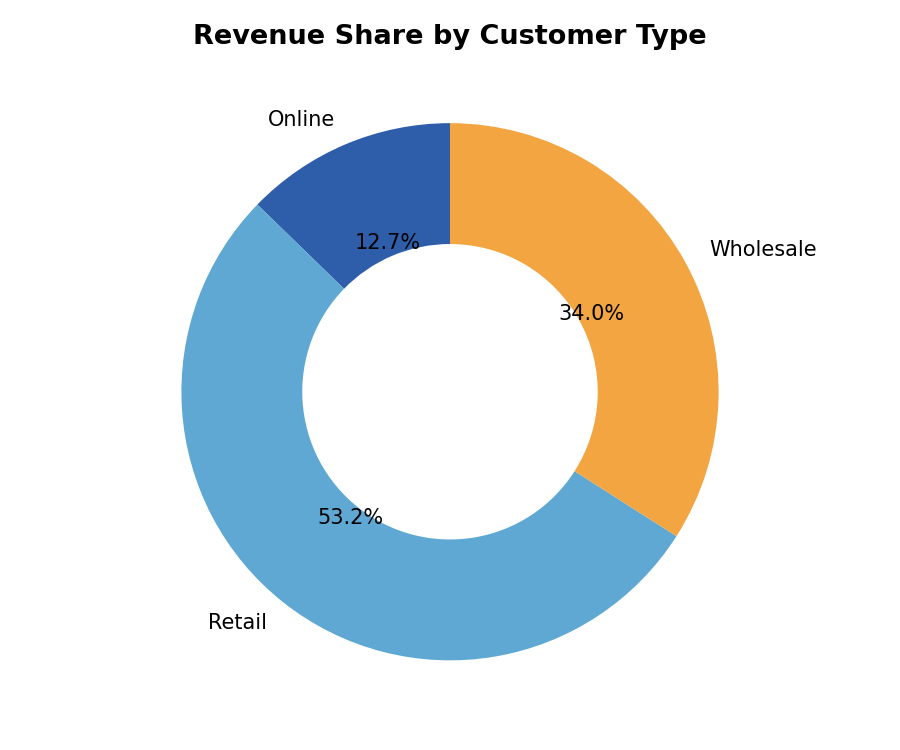
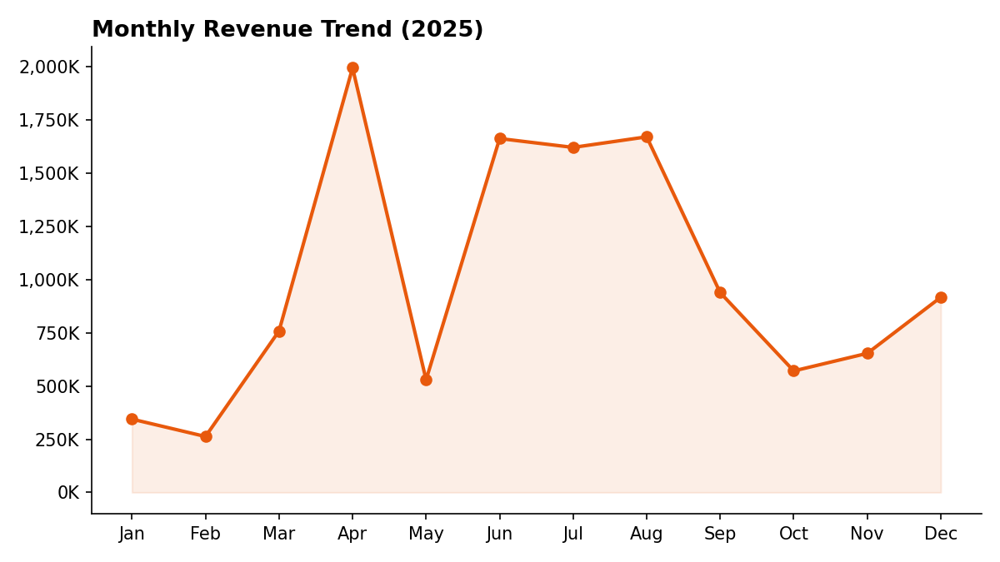
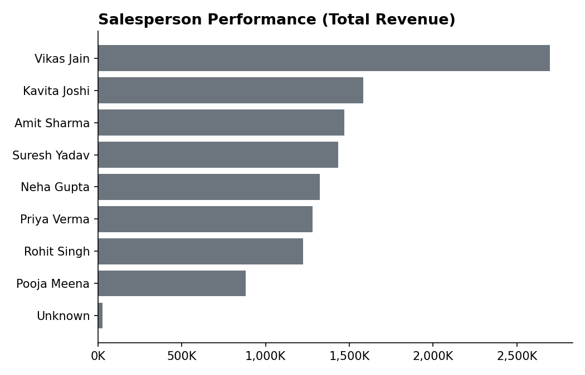

# Sales Performance Analysis — 2025

**Business Analyst Portfolio Project | Excel (Formulas + Dashboard)**

## 1. Business Problem

A retail company sells Electronics, Furniture, Appliances, and Stationery across four regions in India through Retail, Wholesale, and Online channels. Leadership wants to understand where revenue is concentrated, which products and salespeople are driving performance, and whether discounting is helping or hurting revenue — so they can plan inventory, sales targets, and promotions for next year.

## 2. Dataset

- 152 raw sales transactions for 2025 (`Sales_Data_Test_Dataset.xlsx`)
- Fields: Order ID, Order Date, Region, City, Salesperson, Category, Product, Customer Type, Units Sold, Unit Price, Discount
- The raw file intentionally contained data quality issues, which is part of what this project addresses.

## 3. Data Cleaning

| Issue Found | Action Taken |
|---|---|
| 2 fully duplicated order rows | Removed duplicates, kept first occurrence |
| Inconsistent region text (`" West "`, `"north"`) | Trimmed whitespace and standardized casing |
| 1 missing Salesperson | Filled as `"Unknown"` |
| 1 missing Units Sold | Imputed using the median units sold for that product category |
| No revenue figure | Added calculated column: `Revenue = Units Sold × Unit Price × (1 − Discount)` |

Full step-by-step log is in the `Cleaning_Log` sheet of the Excel workbook and in `01_clean_data.py`.

## 4. Tools & Approach

- **Excel** — cleaned data, formula-driven summary tables (`SUMIF`/`COUNTIF`), and a 6-chart dashboard, all dynamically linked to the source data

## 5. Key Insights

**Revenue is heavily concentrated in one region and one category.** The East region generated the highest revenue, well ahead of South, North, and West.



**Electronics is the dominant category**, contributing roughly 64% of total revenue, more than Furniture, Appliances, and Stationery combined. *Laptop Pro 14* alone accounts for over ₹42 lakh in revenue, making it the single best-selling product.



**Retail and Wholesale customers drive most of the business**, with Online sales contributing the smallest share — a potential growth opportunity if the company wants to expand its digital channel.



**Revenue peaked in April** and showed a second smaller peak mid-year, with a gradual decline toward year-end — useful for planning inventory and staffing around seasonal demand.



**Sales performance varies widely by person**, with the top salesperson generating roughly 1.8x the revenue of the third-ranked salesperson — a signal for identifying coaching or incentive opportunities.



**Discounting isn't clearly driving extra volume.** Orders with a 5% discount actually had a slightly *higher* average order value than 0% or 10% discounted orders, suggesting discount levels aren't being applied strategically and may be worth a deeper pricing review.

## 6. Recommendations

1. Double down on the East region and Electronics category with focused inventory and marketing investment.
2. Investigate why Online channel revenue lags Retail/Wholesale — consider a digital promotion push.
3. Review the discounting strategy — current discount tiers don't show a clear lift in order value.
4. Use April's seasonal peak to plan stock levels and staffing ahead of time for next year.
5. Study top-performing salespeople's approach and consider replicating it across the team.

## 7. Repository Structure

```
├── Sales_Data_Test_Dataset.xlsx      # Original raw data
├── Sales_Performance_Dashboard.xlsx  # Final deliverable: cleaned data + formulas + dashboard
├── cleaned_sales_data.csv            # Cleaned dataset (Python output)
├── cleaning_log.txt                  # Data cleaning log
├── 01_clean_data.py                  # Cleaning script
├── 02_analyze.py                     # Analysis + chart generation script
├── charts/                           # Generated chart images
└── README.md
```

## 8. How to Reproduce

```bash
pip install pandas openpyxl matplotlib
python 01_clean_data.py
python 02_analyze.py
```

---
*Author: [Your Name] | Business Analyst (Fresher) | [LinkedIn URL]*
